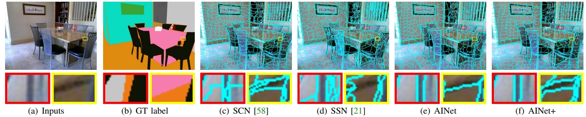

# AINet: Association Implanation Network for Superpixel Segmentation 

This is is a PyTorch implementation of the superpixel segmentation network introduced in ICCV paper (2021):

[Association Implanation Newwork for Superpixel Segmentation](https://openaccess.thecvf.com/content/ICCV2021/papers/Wang_AINet_Association_Implantation_for_Superpixel_Segmentation_ICCV_2021_paper.pdf)


## Results: 

The video results of our AINet (the videos are from Youtube, not included in the training set):
<p align="center">
 
</p>
<p align="center">
 
</p>

Qualitative resutls of superpixel segmentation and object proposal:


## Introduction
The Illustration of AINet:


## Prerequisites
The training code was mainly developed and tested with python 3.7, PyTorch 1.11, CUDA 11.5, and Ubuntu 16.04.

During test, we make use of the component connection method in [SSN](https://github.com/NVlabs/ssn_superpixels) to enforce the connectivity 
in superpixels. The code has been included in ```/third_paty/cython```. To compile it:
 ```console
cd third_party/cython/
python setup.py install --user
cd ../..
```
## Demo
Quick taste! Specify the image path and use the [pretrained model](https://drive.google.com/drive/folders/1cFeXqSKAQQsvyBOPavS3I0A4YIJhiUrR?usp=sharing) to generate superpixels for an image
```console
python run_demo.py --image=PATH_TO_AN_IMAGE --output=./demo 
```
The results will be generate in a new folder under ```/demo``` called ```spixel_viz```.

### Enjoy in the Colab

We also provide an online [Colab demo](https://drive.google.com/drive/folders/1ZudgYbMHjuoLiZRCPe9VVPCM7C9561sY?usp=sharing) 
```console
step 1: click the link and add a shortcut for the shared directory (right click and click the ''Add a shortcut to Drive'' )
step 2: Open the 'AINet-Demo.ipynb' file
step 3: Run the code block one by one
```

### Play in the docker

Go to [Docker directory](https://github.com/wangyxxjtu/AINet-Superpixel/edit/master/docker) and following the introductions.
 
## Data preparation 
To generate training and test dataset, please first download the data from the original [BSDS500 dataset](http://www.eecs.berkeley.edu/Research/Projects/CS/vision/grouping/BSR/BSR_full.tgz), 
and extract it to  ```<BSDS_DIR>```. Then, run 
```console
cd data_preprocessing
python pre_process_bsd500.py --dataset=<BSDS_DIR> --dump_root=<DUMP_DIR>
python pre_process_bsd500_ori_sz.py --dataset=<BSDS_DIR> --dump_root=<DUMP_DIR>
cd ..
```
The code will generate three folders under the ```<DUMP_DIR>```, named as ```/train```, ```/val```, and ```/test```, and three ```.txt``` files 
record the absolute path of the images, named as ```train.txt```, ```val.txt```, and ```test.txt```.


## Training
Once the data is prepared, we should be able to train the model by running the following command:
```console
python main.py --data=<DATA_DIR> --savepath=<PATH_TO_SAVE_CKPT> --workers 4 --input_img_height 208 --input_img_width 208 --print_freq 20 --gpu 0 --batch-size 16  --suffix '_myTrain' 
```
If you want to continue training from a ckpt, just add --pretrained=<PATH_TO_CKPT>. You can specify the training config in the 'train.sh' script.

The training log can be viewed from the `tensorboard` session by running
```console
tensorboard --logdir=<CKPT_LOG_DIR> --port=8888
```

If everything is set up properly, reasonable segmentation should be observed after 10 epochs.

## Testing
We provide test code to generate: 1) superpixel visualization and 2) the```.csv``` files  for evaluation. 

To test on BSDS500, run
```console
python run_infer_bsds.py --data_dir=<DUMP_DIR> --output=<TEST_OUTPUT_DIR> --pretrained=<PATH_TO_THE_CKPT>
```

To test on NYUv2, please first extract our pre-processed dataset from ```/nyu_test_set/nyu_preprocess_tst.tar.gz``` 
to ```<NYU_TEST>``` , or follow the [intruction on the superpixel benchmark](https://github.com/davidstutz/superpixel-benchmark/blob/master/docs/DATASETS.md)
 to generate the test dataset, and then run
```console
python run_infer_nyu.py --data_dir=<NYU_TEST> --output=<TEST_OUTPUT_DIR> --pretrained=<PATH_TO_THE_CKPT>
```

## Evaluation
We use the code from [superpixel benchmark](https://github.com/davidstutz/superpixel-benchmark) for superpixel evaluation. 
A detailed  [instruction](https://github.com/davidstutz/superpixel-benchmark/blob/master/docs/BUILDING.md) is available in the repository, please
 
(1) download the code and build it accordingly;

(2) edit the variables ```$SUPERPIXELS```, ```IMG_PATH``` and ```GT_PATH``` in ```/eval_spixel/my_eval.sh```,
example:

```console
IMG_PATH='/home/name/superpixel/AINet/BSDS500/test'
GT_PATH='/home/name/superpixel/AINet/BSDS500/test/map_csv'

../../bin_eval_summary_cli /home/name/superpixel/AINet/eval/test_multiscale_enforce_connect/SPixelNet_nSpixel_${SUPERPIXEL}/map_csv $IMG_PATH $GT_PATH

```

(3)run 
```console
cp /eval_spixel/my_eval.sh <path/to/the/benchmark>/examples/bash/
cd  <path/to/the/benchmark>/examples/
bash my_eval.sh
```

(4) run 
 ```console
cp ./eval_spixel/my_eval.sh <path/to/the/benchmark>/examples/bash/
cd  <path/to/the/benchmark>/examples/

#the results will be saved to: /home/name/superpixel/AINet/eval/test_multiscale_enforce_connect/SPixelNet_nSpixel_54/map_csv/
bash my_eval.sh
 ```
several files should be generated in the ```map_csv``` folders in the corresponding test outputs including summary.txt, result.txt etc;

(5) cd AINet/eval_spixel
```console
python plot_benchmark_curve.py --path '/home/name/superpixel/AINet/eval/test_multiscale_enforce_connect/' #will generate the similar curves in the paper
```
## Citation
If you use our code, please cite our work:
``` bash
@InProceedings{Wang_2021_ICCV,
    author    = {Wang, Yaxiong and Wei, Yunchao and Qian, Xueming and Zhu, Li and Yang, Yi},
    title     = {AINet: Association Implantation for Superpixel Segmentation},
    booktitle = {Proceedings of the IEEE/CVF International Conference on Computer Vision (ICCV)},
    month     = {October},
    year      = {2021},
    pages     = {7078-7087}
}
```

## Acknowledgement
This code is built on the top of SCN: https://github.com/fuy34/superpixel_fcn Thank the authors' contribution. 
